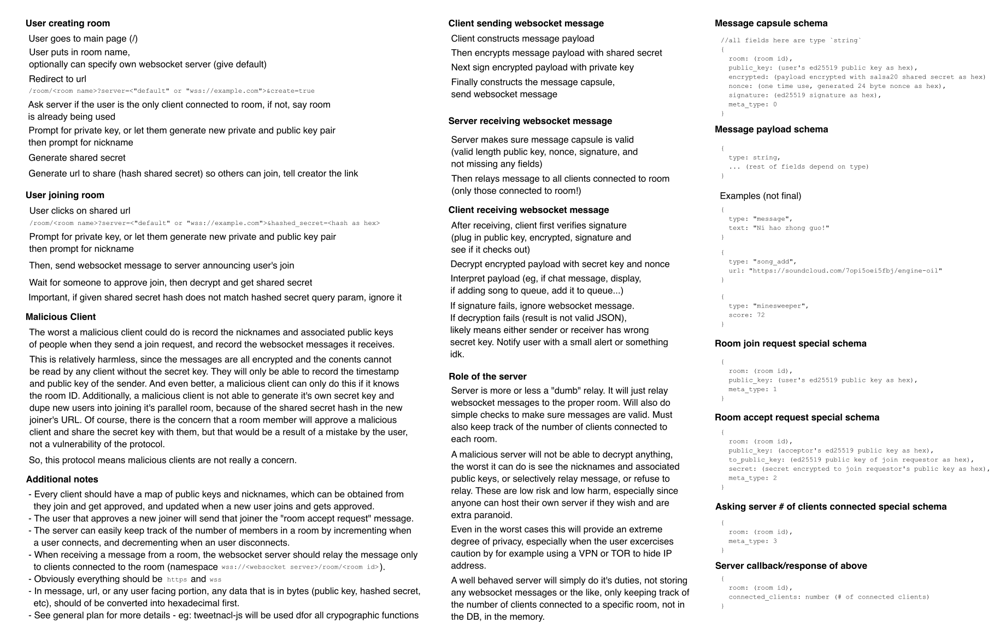

# Music Cove
An ultra private, secure, and easy to use hangout space.

By using our handmade End to End Encryption Protocol, all messages sent are private and secure - not even the server can read your messages! (todo: add TOR page)

Made for Los Altos Hacks 7.

## Quick Overview
This image give a quick overview of how our homemade e2e encryption protocol works. It is outdated and differs from actual implementation but you get the point.



See the Updated Protocol section for differences.

## Self-hosting Backend

## Self-hosting Frontend

## Updated Protocol

Websocket event names are used, here are the types:
- room-create-req
- room-join-req
- room-join-rsp
- msg

Message capsule/payload schema is different:
```json
{
  "hdr": {
    "rid": string,
    "nonce": string (hex),
    "signK": string (hex)
  },
  "data": string (hex of encrypted then signed message)
}
```

Now instead of an encrypted field and a signature, there is a `data` field that is an encrypted JSON message that is then signed.

The role of the server has also been expanded a little, keeping track of connected sockets and only letting sockets that are accepted listen in a room's messages. This prevents malicious clients from storing websocket messages - which itself is fairly harmless since the data is encrypted - but things like timestamps, nicknames, and public keys could have previously been potentially recorded.
